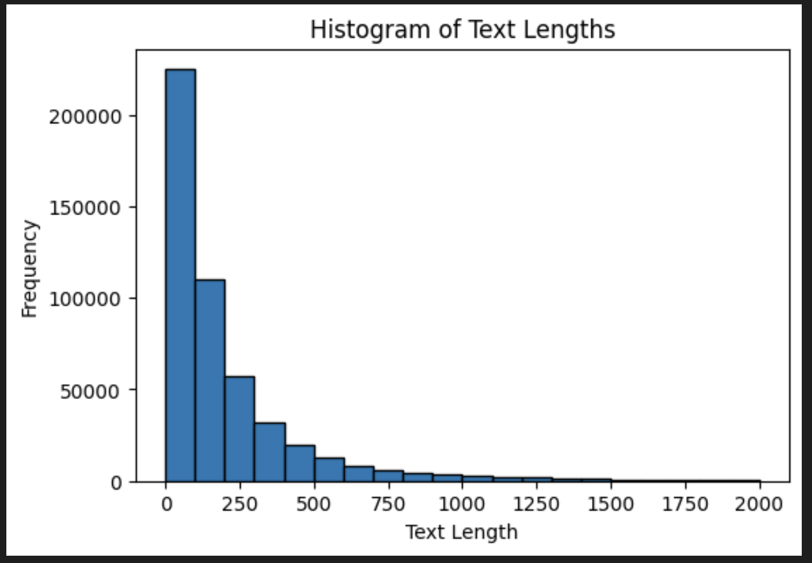

# E-Discovery Synthetic Dataset 

## Run
* Set up Dependencies using the requirements.txt.
* Go to scripts directory. 
* Add your openAI key & device type (default = cpu) in the utils.py. (Should have created a constants or env file, lazy me!)
* Run the main.py
```
pip install -r requirements.txt
cd script
python main.py

```

## Experiment Plan

### Motivation and Objective
* Creation of a Synthetic Dataset of emails based on the Enron emails dataset.
* Removal of PIIs in the generated dataset. 

### Research & Methods Explored
* Analysis and Cleaning of the Enron dataset. 
* Approaches feasibility and comparison for generating new email data was done.
* Some approaches considered were Unconditional Email generation, COnditional Email Generation, Email Response Generation.
* The approaches 1 & 2 involve fine tuning, the third one can be done without any fine tuning but by prompt engineering an existing LLM (OpenAI's GPT was used in our case)

## Experiment Results

### EDA
* Pulled the data from [Huggingface](https://huggingface.co/datasets/snoop2head/enron_aeslc_emails)
* A bit over 500k emails. 
* Below is one sample
```py
"""
Date: Sun, 18 Mar 2001 23:51:00 -0800 (PST)
From: michael.tribolet@enron.com
To: richard.sanders@enron.com
Subject: FW: Energy Suppliers Creditors Group e-mail addresses
Body: 
-----Original Message-----
From:  "Mar, Patricia S." <PMar@mofo.com>@ENRON 
[mailto:IMCEANOTES-+22Mar+2C+20Patricia+20S+2E+22+20+3CPMar+40mofo+2Ecom+3E+40\nENRON@ENRON.com]
Sent: Friday, March 16, 2001 5:36 PM
To: Betty R. London; Bob Anderson; Bob Schwermann; Carl Eklund; Carlos \nGarcia; Dan Pigeon; David Meyer; Dirk C. Minson; Don Wolfe; Edmond Chang; \nFred G. Yanney; Howard Weg; James E. Thompson;
Subject: Energy Suppliers Creditors Group e-mail addresses
Attached is a list I have made of the entities, representatives and e-mail
addressses of the people who have been attending our Energy Suppliers\nCreditors Committee sessions.  Please note that I am missing the name and\ne-mail address of any representative for PacifiCorp.<<1065472.doc>>
============================================================================
This message contains information which may be confidential and privileged.
Unless you are the addressee (or authorized to receive for the addressee),
you may not use, copy or disclose to anyone the message or any information
contained in the message.  If you have received the message in error, please
advise the sender by reply e-mail @mofo.com, and delete the message.
Thank you very much.============================================================================
- 1065472.doc'

"""

```

* Now the structure of the emails is pretty difficult to visualize since the format varies from one email to the other. 
* But there are a few consistencies like Date + Timezone, Sender, Recipients, CC, Subject, Body.
* And there are quite a few other tags as well apart from the ones mentioned above.
* Based on these, some exploratory data analysis was done. 
* Please note that since I am not completely familiar with the entire structure of the emails, there might be a few cases unaccounted for while doing EDA using regex.
* Around 20k unique senders are in the dataset.
* Approx 5% of the emails have an empty subject line. 
* Approx 7% of the emails had no recipient in the "From" header. This looks suspicious. I got rid of those emails. 
* Below is the histogram of number of words used in the email body.

* Based on all the above attributes, I sampled a balanced dataset of 4k emails which we will consider for further experiments. (More details in the EDA notebook inside notebooks directory)

### Unconditional Email Generation 
* This can be achieved by fine tuning a LLM on Enron data with only SOS and EOS
* This way the model learns how to create an email with no input from our side. 
* Pros - 1) Very little pre-processing 2) Emails will resemble the original dataset.
* Cons - 1) Need to fine tune 2) No control over the output 3) Evaluation is difficult.

### Conditional Email Generation
* In this approach, we attempt to use some features being used as inputs for fine tuning a model that generates emails. 
* Here, we need to use the features extracted from the emails present in our dataset. 
* One such sample looks like
```py
{ 'original_email': 'Date: Fri, 15 Mar 2001 07:39:00 -0800 (PST)\nFrom: ravi.allen@enron.com\nTo: stagecoachmama@hotmail.com\nSubject: \nBody: \nLucy,\nHere is the rentroll.\nMy only questions are about #25, and #37 missed rent.  Any special \nreasons?\nIt looks like there are five vacancies #2,12,20a,35,40.  If you want to run \nan ad in the paper with a $50 discount that is fine.\nI will write you a letter of recommendation.  When do you need it?  You can \nuse me as a reference.  In the next five weeks we should really have a good \nidea whether the sale is going through.\nPhillip',
  'subject': '',
  'timezone': 'PST',
  'length': 84,
  'year': '2001',
  'month': 'Mar',
  'recipients': 1,
  'cc_participants': 0,
  'is_reply': 0,
  'summary': 'Questions about #25 and #37 missied rent, 5 vacancies #2, 12, 20a, 35,40, letter of recommendation to be written, good time frame to know about sale: 5 weeks.',
  }
```
* From the above dictionary, we can exclude the original email and use the remaining to be fed as the input for the generation after preprocessing. And concatenate the original email as the output while fine tuning any LLM. 
* This way, we can have a conditional generation of emails dataset.
* Pros - 1) We can just give some info to the tuned model for inference and it'll generate an email for us based on the style of the dataset it was trained on.
* Cons - 1) Need to do fine tuning 2) Need to prompt the info in the same format as the original dataset for generation.


### Email Response Generation
* This method is pretty straight-forward. 
* Using a curated & crafted prompt concatenated alongside the emails from the dataset, we just prompt an existing LLM to generate responses for us. 
* Sample prompt used. 
```py
prompt_1 = """Parse the provided email data and generate the following information as a single line json:

* subject: The subject line of the provided email if present.
* timezone: The timezone of the provided email if available.
* length: The total number of words in the provided email body.
* year: The year extracted from the date header in the provided email.
* month: The month extracted from the date header in the provided email.
* recipients: The total number of recipients in the provided email.
* cc_participants: The number of participants in the CC field (0 if None) in the provided email.
* is_reply: A boolean value (0 or 1) indicating whether the email is a reply based on the presence of "Re:" in the provided email.
* summary: A concise summary of the email content, capturing key points like:
    * Reason for the email 
    * Actions proposed 
    * Any mentioned deadlines or timeframes.
* response: Generate an email response to the provided email in the same format as the input email from the perspective of the main recipient.

** For the response, please strictly adhere to the provided email format which contains Date, From, To, CC, Subject, Body.

**Provided Email:**

"""

```
* One output response from the model looks like. 
```py
"""
{ 'original_email': 'Date: Fri, 15 Mar 2001 07:39:00 -0800 (PST)\nFrom: ravi.allen@enron.com\nTo: stagecoachmama@hotmail.com\nSubject: \nBody: \nLucy,\nHere is the rentroll.\nMy only questions are about #25, and #37 missed rent.  Any special \nreasons?\nIt looks like there are five vacancies #2,12,20a,35,40.  If you want to run \nan ad in the paper with a $50 discount that is fine.\nI will write you a letter of recommendation.  When do you need it?  You can \nuse me as a reference.  In the next five weeks we should really have a good \nidea whether the sale is going through.\nPhillip',
  'subject': '',
  'timezone': 'PST',
  'length': 84,
  'year': '2001',
  'month': 'Mar',
  'recipients': 1,
  'cc_participants': 0,
  'is_reply': 0,
  'summary': 'Questions about #25 and #37 missied rent, 5 vacancies #2, 12, 20a, 35,40, letter of recommendation to be written, good time frame to know about sale: 5 weeks.',

  'response': 'Date: Fri, 15 Mar 2001 07:39:00 -0800 (PST)\nFrom: stagecoachmama@hotmail.com\nTo: ravi.allen@enron.com\nSubject: Re: Rentroll\nLucy, Yes, please write me a letter of recommendation. As for the sale, it should be finalized within the next five weeks. I will definitely keep you updated. Thank you for your help and support. Regards, Phillip'}
"""

```
* As evident, this method can result directly a response which is an email. Also, the other attributes extracted can be used to train a model using the previous method.
* Pros - 1) No fine tuning, hence time taken is pretty less. 2) Responses are based on the attributes which LLM is extracting itself, hence they are pretty close to what a human response will look like. 
* Cons - 1) Not fine tuned on our dataset, hence qualitative analysis needs to be done.
* Solution - One solution is that within the dataset, we can find mail-response pairs or even conversation chains, then we can create a conversational dataset which can be used for fine tuning a model. And then later, we can do inference accordingly.


### PII Masking 

#### Using Prompt Engineering
* This method is pretty simple. 
* We just need to prompt the LLM itself to add masks instead of sentitive named entities.
* Pros - No computational increment.
* Cons - May not work all the time, need to engineer the prompts well.

#### Using NER
* The approach is an improvement on previous one. 
* We run a Bert based NER model to extract coordinates of Person's names, Organizations etc. 
* Then all those words are replaced by masked words.
* Pros - 1) Very accurate removal of confidential info
* Cons - 1) Loss of contextual information sometimes. 
* Example
```py
"""
Date: Fri, 12 Jan 2001 09:00:00 -0800 (PST)
From: gregory.carraway@enron.com
To: errol.mclaughlin@enron.com
CC:
Subject: Re: Gas Daily deals in dispute
Body:
Errol,

Thank you for letting me know that Sherry Dawson has taken care of the Gas Daily deals in dispute. I appreciate the update.

Best,
Greg
"""
```
becomes

```py
"""
Date: Fri, 12 Jan 2001 09:00:00 -0800 (PST)
From: <person>gor<person>.<person>@<org>.com
To: <person>rol.<person>.com
CC:
Subject: Re: <org> deals in dispute
Body:
<person>,

Thank you for letting me know that <person> has taken care of the <org> deals in dispute. I appreciate the update.

Best,
<person>

"""
```

#### Using NER with hashing
* Previous method is good, but has a flaw that since we are referring to all the entities of a class as the same, we might lose context sometimes.
* An additional step of creating a temporary dictionary which assigns indices to each instance of a class and then is referred like that can solve it.
* Changed output would look like (I haven't implemented this yet)
```py
"""
Date: Fri, 12 Jan 2001 09:00:00 -0800 (PST)
From: <person1>gor<person2>.<person>@<org>.com
To: <person3>rol.<person4>.com
CC:
Subject: Re: <org> deals in dispute
Body:
<person5>,

Thank you for letting me know that <person6> has taken care of the <org> deals in dispute. I appreciate the update.

Best,
<person7>
"""

```
* Need to tweak a bit for handling names within email addresses and mapping them to actual names.